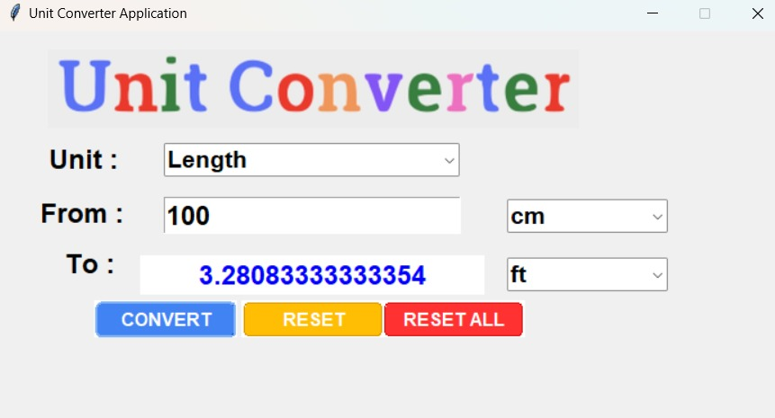
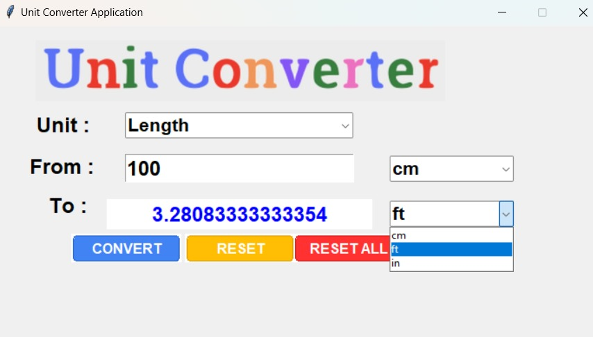
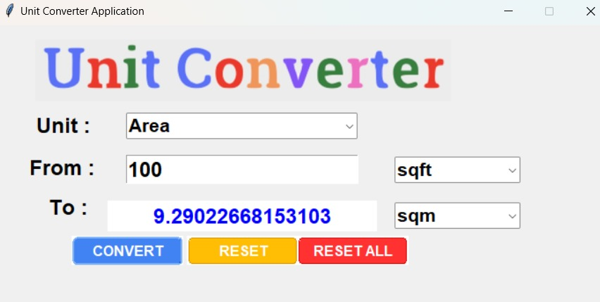
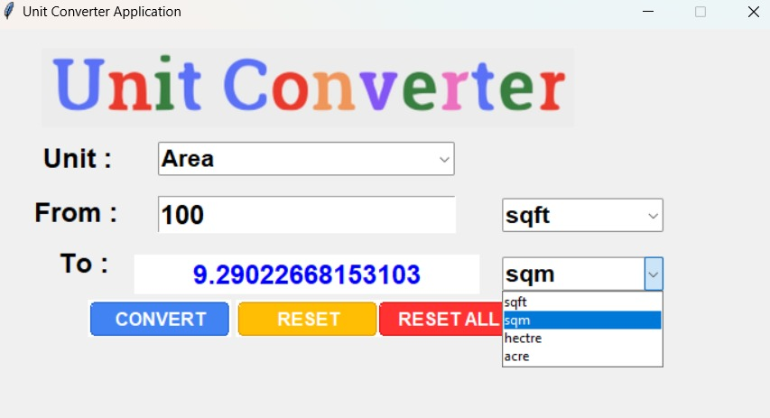

# Unit Conversion
Unit conversion GUI made using Python and Tkinter Library for Length and Area conversions

## Initial Output Screen:

## Length

Different conversions that can be done under this include:

- centimeter to feet
- centimeter to inch
- feet to centimeter
- feet to inch
- inch to centimeter
- inch to feet

  ### Conversion Screen:

  

  ### Conversion Options:

  

 ## Area

Different conversions that can be done under this include:

- Square feet to Square meter
- Square feet to Hectare
- Square feet to Acre
- Square meter to Square feet
- Square meter to Hectare
- Square meter to Acre
- Hectare to Square feet
- Hectare to Square meter
- Hectare to Acre
- Acre to Square feet
- Acre to Square meter
- Acre to Hectare

  ### Conversion Screen:

  

  ### Conversion Options:

   
